# ⌨️ SWACHRON (스웨크론)

> **기계식 키보드 판매 · 경매 쇼핑몰 + 3D 커스텀 빌더 + AI 챗봇**  
> 키크론(상품)과 스웨그키(swagkey, 프론트)를 결합한 컨셉의 **1인 풀스택** 웹 서비스

[](https://swachron.shop)
[](https://github.com/shin-sang-hoon/keyboard-shop)
[](https://github.com/shin-sang-hoon/keyboard-shop/commits/main)
[](https://github.com/shin-sang-hoon/keyboard-shop)

> 🌐 **[라이브 데모 바로가기 → https://swachron.shop](https://swachron.shop)** ⭐  
> AWS에 **HTTPS로 실제 배포**된 서비스입니다. 홈 · 상품 · 3D 빌더 · 장바구니 · 결제(테스트) · AI 챗봇 · 실시간 경매를 직접 체험할 수 있습니다.

---

## 📌 프로젝트 개요

| 항목 | 내용 |
|---|---|
| **프로젝트명** | SWACHRON (스웨크론) |
| **개발 기간** | 2026.04.08 ~ 2026.06.07 (약 61일) |
| **인원** | **1인 (단독 개발)** |
| **담당 범위** | 기획 · ERD/도메인 설계 · 백엔드 · 프론트엔드 · 3D · AI 챗봇 · 인프라/배포 **전 영역** |
| **배포 환경** | AWS EC2 (t3.small) + RDS + Redis + Nginx + Docker Compose + HTTPS |
| **라이브 데모** | [https://swachron.shop](https://swachron.shop) |

### 한 줄 소개

> 단순 구매를 넘어, 사용자가 **3D 화면에서 케이스 · 스위치 · 키캡을 직접 조합**하고, **AI 챗봇으로 키보드를 추천**받으며, **한정판 키보드를 실시간 경매**로 살 수 있는 기계식 키보드 쇼핑몰. 팀 프로젝트에서 익힌 풀스택 흐름을 **혼자 처음부터 끝까지 책임지며 깊이를 더한** 개인 프로젝트입니다. (판매 노출 상품 **222개** = 키보드 104 · 키캡 93 · 액세서리 24 · 스위치 부품 1)

---

## 🏗 시스템 아키텍처

```
                    🌐 swachron.shop  (HTTPS / Let's Encrypt)
                                 │
                     ┌───────────▼────────────┐
                     │     Nginx (리버스 프록시)     │
                     │  / 정적 · /api · /uploads · /models(GLB) │
                     └───────────┬────────────┘
              ┌──────────────────┼───────────────────┐
              │                  │                   │
     ┌────────▼────────┐  ┌──────▼───────┐     (외부 API 연동)
     │  React Frontend │  │  Spring Boot  │──────► Google Gemini  (RAG 챗봇)
     │  (Vite · R3F 3D)│◄─┤  (JPA · JWT · │──────► PortOne V2     (결제)
     └─────────────────┘  │   WebSocket · │
                          │   Gemini 챗봇) │
                          └──────┬────────┘
                       ┌─────────┴─────────┐
                  ┌────▼─────┐        ┌────▼────┐
                  │   RDS    │        │  Redis  │
                  │ (MySQL)  │        │ (캐시)   │
                  └──────────┘        └─────────┘

  🐳 배포: AWS EC2 t3.small + Docker Compose (Nginx · Spring Boot · React 빌드)
           + swap 4GB (소형 인스턴스 OOM 방지)
  🔒 HTTPS: Let's Encrypt 인증서 + 커스텀 도메인 (swachron.shop)
  ※ 핵심 차별점: AI 챗봇을 별도 Python 서버 없이 Spring Boot가 Gemini API를 직접 호출
```

> 프론트엔드 · API · 정적 자산(GLB)을 **단일 도메인(swachron.shop)** 으로 통합하고, Nginx 리버스 프록시가 경로별(`/`, `/api`, `/uploads`, `/models`)로 라우팅합니다.
> DB는 **RDS(MySQL)**, 캐시는 **Redis**, 챗봇은 **Spring Boot 내부에서 Gemini API를 직접 호출**하는 구조라, 팀 프로젝트(별도 Flask 챗봇 컨테이너)와 달리 **운영 컨테이너 수를 줄여 소형 인스턴스에 최적화**했습니다.
>
> 🧩 **데이터 수집 파이프라인(별도 · 빌드 타임):** 상품 데이터는 **FastAPI + Playwright 크롤러**(`/fastapi`)와 **네이버 쇼핑 Open API**로 로컬에서 수집해 DB에 적재했습니다. 이 크롤러는 **운영 런타임에는 포함되지 않는** 1회성 데이터 구축 도구입니다.

---

## 🗂 ERD (Entity Relationship Diagram)

> SWACHRON의 실제 데이터베이스 구조입니다. **총 31개 엔티티**를 도메인별로 그룹화했습니다.
> (회원·인증 / 상품·카탈로그 / 필터 / 장바구니·주문 / 3D 빌드 / 커뮤니티 / 경매 / 챗봇 / 운영·로그)

```mermaid
erDiagram
    %% ===== 회원 & 인증 =====
    USER ||--o| CART : "1:1 장바구니"
    USER ||--o{ ORDER : "주문"
    USER ||--o{ REVIEW : "리뷰"
    USER ||--o{ QNA : "상품 문의"
    USER ||--o{ WISHLIST : "찜"
    USER ||--o{ PRODUCT_LIKE : "좋아요"
    USER ||--o{ CUSTOM_BUILD : "커스텀 빌드"
    USER ||--o{ AUCTION : "판매자(seller)"
    USER ||--o{ AUCTION_BID : "입찰"
    USER ||--o{ AUCTION_WATCH : "경매 관심"
    USER ||--o{ AUDIT_LOG : "관리자 행위"
    USER ||--o{ PASSWORD_RESET_TOKEN : "비밀번호 재설정"
    USER ||--o{ REVIEW_REPORT : "신고자/처리자"

    %% ===== 상품 카탈로그 =====
    BRAND ||--o{ PRODUCT : "브랜드"
    CATEGORY ||--o{ PRODUCT : "대분류(레거시)"
    CATEGORY ||--o{ CATEGORY : "계층(parent/children)"
    SUB_CATEGORY ||--o{ PRODUCT : "하위 분류"
    PRODUCT ||--o{ PRODUCT_IMAGE : "이미지(썸네일/갤러리/상세)"
    PRODUCT ||--o{ PRODUCT_DETAIL_IMAGE : "WYSIWYG 인라인 이미지"
    PRODUCT ||--o{ PRODUCT_TAG : "태그 매핑"
    TAG ||--o{ PRODUCT_TAG : ""

    %% ===== 동적 필터 =====
    FILTER_GROUP ||--o{ FILTER_OPTION : "그룹별 옵션"

    %% ===== 장바구니 / 주문 =====
    CART ||--o{ CART_ITEM : "담은 상품"
    PRODUCT ||--o{ CART_ITEM : ""
    ORDER ||--o{ ORDER_ITEM : "주문 품목"
    PRODUCT ||--o{ ORDER_ITEM : ""

    %% ===== 3D 빌더 =====
    PRODUCT ||--o{ CUSTOM_BUILD : "기반 모델(glbUrl)"

    %% ===== 커뮤니티 =====
    PRODUCT ||--o{ REVIEW : "상품 리뷰"
    ORDER_ITEM ||--o{ REVIEW : "구매 인증 연결"
    REVIEW ||--o{ REVIEW_REPORT : "리뷰 신고"
    PRODUCT ||--o{ QNA : "상품 문의"
    PRODUCT ||--o{ WISHLIST : ""
    PRODUCT ||--o{ PRODUCT_LIKE : ""
    NOTICE ||--o{ NOTICE_ATTACHMENT : "첨부파일"

    %% ===== 경매 =====
    PRODUCT ||--o{ AUCTION : "한정판 중고 경매"
    AUCTION ||--o{ AUCTION_BID : "실시간 호가"
    AUCTION ||--o{ AUCTION_WATCH : "관심 등록"

    USER {
        bigint id PK
        string email UK
        string password "BCrypt (LOCAL)"
        string name
        string nickname
        string phone
        string zipcode
        string address
        string addressDetail
        enum role "USER / ADMIN"
        enum provider "LOCAL / KAKAO"
        string providerId "소셜 식별자"
        enum status "ACTIVE / SUSPENDED / WITHDRAWN"
        datetime withdrawnAt "탈퇴 시각"
        datetime suspendedAt "제재 시각"
        string suspendReason
        string adminMemo
        datetime lastLoginAt
    }

    PRODUCT {
        bigint id PK
        bigint brand_id FK
        bigint category_id FK
        bigint sub_category_id FK
        string name
        text description "LONGTEXT · WYSIWYG HTML"
        string imageUrl "외부 이미지 URL"
        int price
        int stock "NOT NULL DEFAULT 0 · 품절 판정"
        string sourceId UK "크롤 출처 ID"
        string layout
        string switchType
        string switchName
        string mountingType
        string connectionType
        string gbStatus "공구 상태"
        string glbUrl "3D 모델 경로"
        enum status "ACTIVE / INACTIVE / SOLD_OUT"
        enum productType "KEYBOARD / KEYCAP / SWITCH_PART / ACCESSORY"
    }

    SUB_CATEGORY {
        bigint id PK
        string productType "대분류 종속"
        string name "하위 분류명"
        datetime createdAt
    }

    PRODUCT_IMAGE {
        bigint id PK
        bigint product_id FK
        string imageUrl
        enum imageType "THUMBNAIL / GALLERY / DETAIL"
    }

    PRODUCT_DETAIL_IMAGE {
        bigint id PK
        bigint product_id FK
        string url "/uploads/..."
        string storedName
        string originalName
        long fileSize
        enum status "PENDING / CONFIRMED"
    }

    CART {
        bigint id PK
        bigint user_id FK "1:1"
    }

    CART_ITEM {
        bigint id PK
        bigint cart_id FK
        bigint product_id FK
        string layout "빌드 옵션"
        string switchType
        string keycapColor
        string caseColor
        int unitPrice
    }

    ORDER {
        bigint id PK
        bigint user_id FK
        int totalPrice
        enum status "PENDING / PAID / SHIPPING / DELIVERED / CANCELLED"
        string paymentId "PortOne paymentId"
        string payMethod
        string receiverName
        string receiverPhone
        string postcode
        string address
        string addressDetail
    }

    ORDER_ITEM {
        bigint id PK
        bigint order_id FK
        bigint product_id FK
        int quantity
        int price "주문 시점 가격 스냅샷"
        string layout "빌드 옵션 스냅샷"
        string keycapColor
        string caseColor
    }

    CUSTOM_BUILD {
        bigint id PK
        bigint user_id FK
        bigint product_id FK "기반 GLB"
        string buildConfig "구성 JSON"
        string layout
        string switchType
        string keycapColor
        string caseColor
        int totalPrice
    }

    REVIEW {
        bigint id PK
        bigint user_id FK
        bigint product_id FK
        bigint order_item_id FK "구매 인증"
        double rating "별점"
        string content
        string reply "관리자 답변"
        bigint replied_by FK
    }

    REVIEW_REPORT {
        bigint id PK
        bigint review_id FK
        bigint reporter_id FK
        enum reason "SPAM / ABUSE / ADULT / FALSE_INFO / ETC"
        string detail
        enum status "PENDING / RESOLVED / DISMISSED"
        bigint handled_by FK
    }

    QNA {
        bigint id PK
        bigint user_id FK
        bigint product_id FK
        string content
        string answerContent "관리자 답변"
        bigint answered_by FK
        datetime answeredAt
    }

    AUCTION {
        bigint id PK
        bigint seller_id FK
        bigint product_id FK
        enum condition "NEW / EXCELLENT / GOOD / FAIR"
        int startPrice "시작가"
        int currentPrice "현재가"
        int startPricePercent "정가 대비 할인율(30~70)"
        enum status "ACTIVE / ENDED / CANCELLED"
        datetime startAt
        datetime endAt
        long version "낙관적 락 (동시 입찰 정합성)"
    }

    AUCTION_BID {
        bigint id PK
        bigint auction_id FK
        bigint user_id FK
        int bidPrice
        datetime createdAt
    }

    CHATBOT_QA {
        string id PK
        string category "키보드 도메인 분류"
        string question
        string answer
        string keywords "키워드 검색용"
    }

    UNKNOWN_QUERY_LOG {
        bigint id PK
        string question "미인식 질문"
        string reason
        int topScore "최고 유사도 점수"
    }

    AUDIT_LOG {
        bigint id PK
        bigint admin_id FK
        enum category "PRODUCT / USER / ORDER / CRAWLER / CHATBOT / CRUD"
        enum eventType "CREATE / UPDATE / DELETE / BLOCK / EXECUTE / VIEW ..."
        string targetType
        string targetId
        string detail
        string ipAddress "민감정보 마스킹"
        string result
        long durationMs
    }
```



### 🎯 ERD · 설계 포인트

| 설계 결정 | 이유 / 구현 | 효과 |
|---|---|---|
| **경매 동시 입찰 정합성** (`Auction.version`) | `@Version` 낙관적 락 + WebSocket 실시간 호가 | 여러 사용자가 동시에 입찰해도 **갱신 손실(lost update) 없이** 최고가 보장 |
| **리뷰 구매 인증** (Review → OrderItem FK) | 리뷰를 `OrderItem`에 직결 + `PurchaseGuard` 검증 | **구매자만 리뷰 작성** (주문 품목 단위로 1회) |
| **좋아요/찜 분리** (ProductLike · Wishlist) | 가벼운 반응(좋아요)과 구매 의도(찜)를 별도 엔티티로 | 지표/UX를 **목적별로 분리 집계** |
| **이미지 3단 구조** (ProductImage `THUMBNAIL/GALLERY/DETAIL`) | 카드 썸네일·갤러리·상세 인라인을 타입으로 구분 + `displayOrder` 정렬 | 화면별 **필요 이미지만 로딩** |
| **WYSIWYG 인라인 이미지 수명주기** (ProductDetailImage `PENDING→CONFIRMED`) | 업로드는 PENDING, 저장 시 본문 파싱으로 미참조 GC + `ProductDetailImageScheduler`(@Scheduled) 회수 | **고아 파일 누적 방지** |
| **주문 가격·옵션 스냅샷** (OrderItem) | 주문 시점 가격 + 3D 빌드 옵션을 OrderItem에 복사 | 이후 상품/가격이 바뀌어도 **주문 내역 불변** |
| **회원 3-상태 + 제재 감사** (User `ACTIVE/SUSPENDED/WITHDRAWN`) | 본인 탈퇴(withdrawnAt)와 관리자 제재(suspendedAt + suspendReason + adminMemo) 분리 | 정상/정지/탈퇴 **명확한 생애주기 관리** |
| **AOP 감사 로그** (AuditLog + `@AdminAction`) | 관리자 액션을 어노테이션으로 표시 → `AuditLogAspect`가 비동기 이벤트로 기록(소요시간·IP·결과) | 운영 행위의 **추적 가능성** + 민감정보 마스킹 |
| **챗봇 재학습 루프** (UnknownQueryLog) | 답변 실패(미인식) 질문을 점수와 함께 저장 → 관리자 화면에서 QA로 승격 | 데이터가 **운영하며 자라는** 구조 |

---

## 🛠 기술 스택

### Backend
- **언어/프레임워크:** Java 17, Spring Boot 3.x, Spring Security
- **DB/ORM:** MySQL (AWS RDS), Spring Data JPA (Hibernate), Redis
- **인증:** JWT (Access / Refresh), Kakao OAuth2
- **실시간:** STOMP WebSocket + SockJS
- **문서화:** Swagger (SpringDoc OpenAPI)
- **테스트:** JUnit — Service 레이어 단위 테스트 **51개** (리뷰·Q&A·좋아요·찜 도메인 중심)

### Frontend
- **언어/빌드:** JavaScript (JSX), React **19**, Vite
- **상태 관리:** Zustand
- **라우팅:** React Router (v7)
- **HTTP:** Axios (JWT 인터셉터 + 401 Refresh 처리)
- **3D:** Three.js + React Three Fiber + drei, GLTFLoader
- **에디터:** TipTap (상품 상세 WYSIWYG, 이미지 확장)
- **결제:** PortOne V2 (`@portone/browser-sdk`)

### AI Chatbot — "크론이"
- **방식:** **Google Gemini (Flash, `gemini-flash-latest`) 기반 RAG** + **IntentClassifier(의도 분류)**
- **파이프라인:** 의도 분류 → (FAQ 시) ChatbotQa **키워드 검색**으로 후보 추출 → 컨텍스트로 **Gemini 답변 생성**
- **연동:** Spring Boot 내부에서 Gemini API 직접 호출 (`ChatbotLlmClient` 인터페이스로 추상화 — LLM 교체 용이)
- **데이터:** 키보드 도메인 QA(MySQL `chatbot_qa`) + 미인식 질문 로그(`UnknownQueryLog`)
- **캐시:** Redis (동일 질문 응답 가속)

### Infra / DevOps
- **클라우드:** AWS EC2 (t3.small, 단일 인스턴스, Ubuntu) + 탄력 IP
- **DB:** AWS RDS (MySQL)
- **컨테이너:** Docker Compose — Nginx · Spring Boot · React 빌드
- **웹 서버:** Nginx (리버스 프록시 + 프론트 정적 서빙 + GLB 정적 서빙)
- **HTTPS:** Let's Encrypt (Certbot) + 커스텀 도메인 (swachron.shop)
- **결제:** PortOne V2 (KG이니시스 — 테스트 모드)
- **안정화:** swap 4GB 영구 등록(소형 인스턴스 빌드 OOM 방지)

### Data Pipeline (빌드 타임 · 운영 런타임 제외)
- **크롤러:** Python, FastAPI, Playwright (swagkey 이미지 추출), 네이버 쇼핑 Open API (메타데이터 수집)
- 초기 약 2,500개 메타데이터를 DB에 적재하고, **이미지까지 온전히 확보한 222개**를 판매 노출 상품으로 큐레이션

---

## 🧩 핵심 구현 영역 (1인 전담)

> 팀 프로젝트(MUREAM)에서 분업으로 익힌 풀스택 흐름을, 이번에는 **처음부터 끝까지 혼자 책임지며** 백엔드 · 프론트 · 3D · AI · 인프라 전 영역을 직접 구현했습니다.

### 1. 인증 · 계정 도메인
- **JWT Access / Refresh** 인증 + **Kakao OAuth2** 소셜 로그인 (`KakaoOAuthClient`, `LOCAL / KAKAO` Provider 분기)
- **3단계 회원가입** (가입방식 → 약관 동의 → 정보 입력) + 마지막 단계 새로고침 시 PII 누설 차단 가드
- 비밀번호 찾기(`PasswordResetService` + `MailService` 토큰 메일), 아이디 찾기, **회원 3-상태** 관리(정상/정지/탈퇴 — soft delete + 관리자 제재 사유·메모)
- **user enumeration 방어** — 로그인 실패 메시지 통일, 인증 401(`RestAuthenticationEntryPoint`) / 인가 403(`RestAccessDeniedHandler`) 분리

### 2. 상품 · 카테고리 도메인
- 상품 타입 **4축 분류**(`ProductType` — KEYBOARD / KEYCAP / SWITCH_PART / ACCESSORY) + **하위 카테고리(SubCategory) CRUD**
- 검색 · 필터 · 페이징 — **동적 필터(FilterGroup/FilterOption)**, JPA Specification(`repository/spec`), Redis 캐싱
- **품절 판정** — `stock = 0`(노출 status와 직교), 관리자 [품절/판매재개] PATCH
- **상세정보 WYSIWYG (TipTap)** — `description` LONGTEXT(목록 제외 detail-only 로딩), 인라인 이미지 수명주기 GC(@Scheduled) + 렌더 단 **DOMPurify XSS 무해화**(defense-in-depth)

### 3. 장바구니 → 주문 → 결제
- **Cart(1:1) → CartItem** (3D 빌드 옵션 포함) → **Order**(5단계 상태) 생성 시 **가격·옵션 스냅샷** + **재고 차감**
- **PortOne V2 결제** (`PaymentService` + `PortOneClient`) — 서버사이드 금액 검증으로 위변조 차단
- **구매 인증 가드**(`PurchaseGuard`) — 리뷰·Q&A 등 작성 권한 검증

### 4. AI 챗봇 "크론이"
- **IntentClassifier** 5분기 — 인사 / **불만→상담원 연결** / **모호 지칭사→되묻기** / 추천 / FAQ
- **FAQ는 RAG** — `chatbot_qa` 키워드 검색으로 후보 추출 → Gemini로 답변 생성, **`ChatbotLlmClient` 추상화**
- `ChatbotQaImporter`로 QA 적재, **미인식 질문(`UnknownQueryLog`) → 관리자 QA 승격** 루프, Redis 캐시
- *(딥러닝 → LLM API로의 기술 전환 배경은 트러블슈팅 참고)*

### 5. 3D 키보드 빌더
- **Three.js / React Three Fiber + drei** + 실제 키크론 GLB 모델 (STEP → GLB 변환: `occt-import-js` + `gltf-transform`)
- **GLB 15종**의 케이스 · 스위치 · 키캡 색상 **실시간 변경** + `BuilderPriceCalculator` 옵션 가격 자동 합산
- **BroadcastChannel API**로 메인 페이지 ↔ 3D 창 **양방향 실시간 동기화**, 빌드 구성 그대로 장바구니 연동

### 6. 실시간 경매
- **STOMP WebSocket**(`AuctionWebSocketController` + `AuctionLiveService`) 기반 실시간 호가 갱신
- **"한정판 키보드 중고 경매"** — 관리자가 **할인율(30~70%)** + **중고 상태**(NEW/EXCELLENT/GOOD/FAIR) 설정
- **`@Version` 낙관적 락**으로 동시 입찰 정합성 보장, `AuctionScheduler`로 마감 자동 종료·낙찰 (자세한 내용은 트러블슈팅)

### 7. 관리자 Hub + 운영
- **다도메인 관리자 페이지**(회원 · 상품 · 상품상세 · 주문 · 공지 · 경매 · 리뷰 · Q&A · 통계 · 브랜드/카테고리/태그/필터) — 2단 사이드바 + Outlet
- **AOP 감사 로그** — `@AdminAction` 어노테이션 → `AuditLogAspect`가 **비동기 이벤트**로 기록(소요시간·IP·결과) + 민감정보 마스킹
- **신고 처리 분기** — `ReviewReport` RESOLVED(리뷰 숨김) / DISMISSED(기각), `AdminStats` 대시보드

---

## 📸 주요 기능

| 기능 | 설명 |
|---|---|
| 회원 · 인증 | JWT Access/Refresh + Kakao OAuth, 3단계 회원가입, 비밀번호·아이디 찾기, 3-상태(정상/정지/탈퇴) |
| 상품 · 카테고리 | 222개 상품(4축 분류), 하위 카테고리, 동적 필터·검색·페이징, WYSIWYG 상세 + XSS 무해화 |
| 장바구니 · 주문 · 결제 | Cart→Order 스냅샷·재고 차감, **PortOne V2 서버 검증 결제** |
| 3D 키보드 빌더 | GLB 15종 케이스·스위치·키캡 실시간 색상 변경 + 가격 합산, 멀티 창 동기화 |
| AI 챗봇 "크론이" | **Gemini RAG + IntentClassifier**(불만→상담원/모호→되묻기), 미인식 재학습 루프 |
| 실시간 경매 | STOMP WebSocket 호가, 한정판 중고 경매(할인율·중고등급), 낙관적 락 동시성 |
| 리뷰 · Q&A · 좋아요 · 찜 | 구매 인증(OrderItem 연결), 별점, 리뷰 신고 처리 |
| 관리자 Hub | 다도메인 운영, AOP 감사 로그(소요시간·IP·마스킹), 통계 대시보드 |

---

## 📁 프로젝트 구조

```
keyboard-shop/
├── frontend/                       # React 19 + Vite (JavaScript)
│   └── src/
│       ├── App.jsx  main.jsx
│       ├── api/                    # axios 모듈 (도메인별 API 클라이언트)
│       ├── stores/                 # Zustand 스토어 (auth 등)
│       ├── pages/                  # 화면 (홈·상품·빌더·장바구니·인증 흐름…)
│       │   └── admin/              # 관리자 페이지
│       ├── components/             # 공통/도메인 컴포넌트
│       │   └── admin/
│       ├── hooks/  utils/  styles/  assets/
│   ├── public/models/              # GLB 모델 (Nginx 볼륨 서빙 · git 제외)
│   ├── nginx.conf  Dockerfile
│
├── backend/                        # Spring Boot 3.x + JPA
│   └── src/main/java/backend/
│       ├── BackendApplication.java
│       ├── controller/             # REST 컨트롤러 + admin/ + auction/(REST·WebSocket)
│       ├── service/                # 비즈니스 로직
│       │   ├── auction/            # AuctionService · AuctionLiveService(실시간)
│       │   └── chatbot/            # ChatbotService · GeminiChatbotClient · IntentClassifier · ChatbotLlmClient
│       ├── repository/             # Spring Data JPA (+ spec/ : Specification)
│       ├── entity/                 # JPA 엔티티 (31개)
│       ├── dto/                    # 요청/응답 DTO (+ auction · cart · chatbot)
│       ├── config/                 # SecurityConfig · WebSocketConfig · RedisConfig · ChatbotQaImporter …
│       │   └── audit/              # AOP 감사 로그 (@AdminAction · AuditLogAspect · EventListener)
│       ├── jwt/                    # JwtFilter · JwtUtil
│       ├── security/               # CustomUserDetailsService
│       ├── scheduler/              # ProductDetailImageScheduler (고아 이미지 GC)
│       └── exception/              # 전역 예외 (BusinessException)
│
├── fastapi/                        # 데이터 수집 크롤러 (Playwright · 빌드 타임 / 운영 제외)
├── docker-compose.yml              # 로컬 개발 (MySQL · Redis)
└── README.md
```

---

## 🌐 라이브 데모 안내

> **데모 사이트: [https://swachron.shop](https://swachron.shop)**

- **결제:** PortOne(KG이니시스) **테스트 모드** 연동 — 실제 결제는 발생하지 않습니다. PG사 테스트 카드로 결제 플로우를 시연할 수 있습니다.
- **상품 데이터:** **222개의 상품**(키보드 104 · 키캡 93 · 액세서리 24 · 스위치 부품 1)이 이미지·가격과 함께 온전히 노출됩니다.
- **3D 빌더:** **15종**의 키보드 모델에서 케이스·스위치·키캡 색상 조합을 실시간으로 확인할 수 있습니다.
- **테스트 계정:** `mac2@test.com` / `test1234`

---

## 🚀 로컬 실행 방법

### 사전 준비
- Java 17, Node.js 20+, Docker Desktop

### 1) Docker (MySQL + Redis) — 먼저 실행
```bash
docker compose up -d        # keyboard_mysql(3306) + keyboard_redis(6379)
```

### 2) 백엔드 (Spring Boot · 포트 8080)
```bash
cd backend
export GEMINI_API_KEY=...        # AI 챗봇 (필수)
# PortOne(storeId/channelKey/secret), MAIL_*, NAVER_* 등은 환경변수/properties 로 주입
./gradlew bootRun
```

### 3) 프론트엔드 (React/Vite · 포트 5173)
```bash
cd frontend
npm install
npm run dev
```
**접속:** http://localhost:5173

> 모든 시크릿(`GEMINI_API_KEY`, PortOne, 메일, 네이버 API 등)은 **백엔드 환경변수**로 보관하며 프론트에 노출하지 않습니다.
> `fastapi/` 크롤러는 데이터 구축용 별도 도구로, 서비스 실행에는 필요하지 않습니다.

---

## 🤔 트러블슈팅

> 이 프로젝트의 핵심 차별점인 **3D 빌더 · AI 챗봇 · 실시간 경매**, 세 가지에서 직접 부딪혀 해결한 경험입니다.

### ① 🤖 AI 챗봇 — 딥러닝(KoBERT) 이식 → LLM API(Gemini RAG)로의 기술 전환

#### 배경
팀 프로젝트(MUREAM)에서 **TF-IDF + KoBERT 하이브리드(검색형 딥러닝)** 챗봇을 구현해 본 경험이 있어, SWACHRON에서도 처음에는 그 구조를 키보드 도메인으로 **이식**하려 했습니다.

#### 문제 · 고민
1. **인프라 제약** — KoBERT(KR-ELECTRA)는 `torch` 등 무거운 의존성을 요구합니다. 비용을 고려한 **t3.small** 인스턴스에 별도 Python 챗봇 컨테이너를 올리면 메모리 부담이 커, 간결한 AWS 배포에 걸림돌이 됐습니다.
2. **더 본질적인 목표** — 이미 직전 프로젝트에서 딥러닝 기반 챗봇을 경험했으니, 이번에는 의도적으로 **다른 정석(LLM API) 방식**으로도 구현해 보고 싶었습니다.

#### 해결
KoBERT 이식을 중단하고 **Gemini RAG + IntentClassifier** 구조로 재설계했습니다.
1. **IntentClassifier** 가 LLM 호출 전에 의도를 5갈래로 빠르게 분기 — 인사 / **불만→상담원 연결** / **모호 지칭사→되묻기** / 추천 / FAQ (비용·지연 절감 + 안전장치)
2. FAQ는 **RAG** — `chatbot_qa`를 **키워드로 검색**해 후보 Q&A를 추출
3. 후보를 **컨텍스트(systemInstruction)로 Gemini(`gemini-flash-latest`)에 주입**해 도메인에 맞는 자연어 답변 생성
4. **`ChatbotLlmClient` 인터페이스로 추상화** — 구현체(`GeminiChatbotClient`)만 교체하면 다른 LLM으로 전환 가능
5. **Spring Boot 내부 직접 호출**(별도 Python 서버 불필요) + 답변 실패 질문을 **`UnknownQueryLog`** 에 저장해 관리자가 QA로 승격하는 **재학습 루프** 구성

#### 성과 · 배운 점
- 결과적으로 **AI 챗봇을 딥러닝 검색형(KoBERT)과 LLM API(Gemini RAG) 두 가지 방식으로 모두 구현**해 본 경험을 갖게 됐습니다.
- 개발에서 "구현"이라는 **정답은 하나지만, 그곳에 도달하는 "풀이"는 여러 갈래**라는 것 — 마치 수학 문제의 정답은 하나여도 풀이 과정은 여러 개이듯, **제약(인프라)과 목표(다양한 기술 경험)를 함께 보고 기술을 선택하는 판단력**을 체득했습니다.
- 별도 ML 서버 없이 **LLM API로 운영 부담을 낮추면서 답변 품질을 확보**하는 현실적 설계를 직접 경험했습니다.

---

### ② 🧩 3D GLB 모델의 부품(케이스/스위치/키캡) 자동 분리

#### 문제
사용자가 3D에서 케이스·스위치·키캡 색을 **따로** 바꾸려면 GLB 한 모델 안의 **수백 개 mesh를 부위별로 자동 분류**해야 했습니다. 그런데 모델마다 mesh 이름 규칙이 제각각이라 이름만으로는 분류가 부정확했고, **GLTFLoader가 mesh끼리 material 인스턴스를 공유**해 한 곳의 색을 바꾸면 다른 부위까지 함께 바뀌는 문제도 있었습니다.

#### 해결 — 5단계 hybrid 분류 알고리즘 직접 설계
1. **Material clone** — 공유 material 인스턴스를 clone으로 분리(부위별 독립 색상 변경 가능)
2. **PBR 무력화** — `metalness=0`, `roughness=0.7`, `emissive=0` 강제(텍스처가 색을 덮어쓰지 않게)
3. **위치 우선 분류(yTopNorm)** — y축 상대 높이 임계값(0.55)으로 키캡/케이스 1차 분류
4. **parent 그룹화 + 안전망** — 면적 상위 그룹을 케이스로 강제 회수해 떨어져 나간 sub-mesh 보정
5. **케이스 외곽 보호 사후 검증** — 외곽 셸이 키캡으로 오분류되면 케이스로 되돌림

추가로 **WebGL 컨텍스트 누수**는 `forceContextLoss()` 명시 호출로 해결했습니다.

#### 성과 · 배운 점
- 색상 분리가 **안정적으로 동작하는 키보드 15종**(K8 Pro · K1/K5/K7 Max·Pro · K8 HE · K13/K17 Max·Pro · Q8/Q10/Q13 Pro · V1 Max)을 **화이트리스트로 확정**했습니다.
- 일부 구형·이형 모델(슬림·스플릿 등)은 무리하게 100%를 좇기보다 **빌더 대상에서 제외**해, "되는 범위를 정확히 한정"하는 엔지니어링 판단을 했습니다.
- 자동 분류는 만능이 아니며, **위치 + 면적 2차원 매핑 → sub-mesh 회수 → 외곽 보정**의 단계적 hybrid가 현실적이라는 것을 배웠습니다.

---

### ③ 🎯 WebSocket 핫딜 경매 — 기능을 버리지 않고 "컨셉을 전환", 그리고 동시성 정합성

#### 문제
팀 프로젝트에서 익힌 **WebSocket** 을 SWACHRON에도 살리고 싶었지만, 키보드는 **시간제한 선착순 경매와 잘 맞지 않는 상품**이었습니다. 이미 구현한 일반 경매 기능을 폐기해야 할 위기에 놓였고, 실시간 경매에서는 **여러 사용자가 동시에 호가를 올릴 때 데이터 정합성**도 문제였습니다.

#### 해결
1. **컨셉 전환** — 기능을 버리는 대신 *"한정판 키보드 중고 경매"* 로 재설계했습니다. 관리자가 **30~70% 범위의 할인율** + **중고 상태(NEW/EXCELLENT/GOOD/FAIR)** 를 선택할 수 있게 하여 시간 내 경매가 현실적으로 성립하도록 했고, **WebSocket(STOMP) 실시간 호가는 그대로 유지**했습니다.
2. **동시 입찰 정합성** — `Auction` 엔티티에 **`@Version` 낙관적 락**을 두어, 동시에 들어온 입찰이 서로의 갱신을 덮어쓰는 **lost update를 차단**했습니다. 마감 처리는 `AuctionScheduler`가 `endAt` 도달 시 **자동 종료·낙찰**합니다.

#### 성과 · 배운 점
- 구현한 기능을 폐기하지 않고 **컨셉을 바꿔 살려내는 제품 감각** — 9년간 매장을 운영하며 길러진 사업 감각이 기술 의사결정으로 이어진 사례입니다.
- 실시간 동시성 문제를 **낙관적 락**으로 다루며, "여러 명이 같은 자원을 동시에 바꿀 때"의 정합성 설계를 직접 경험했습니다.

---

## 🙋‍♂️ 단독 개발 회고

> Swachron은 팀 프로젝트(MUREAM)에서 분업으로 익힌 풀스택 흐름을, **혼자서 처음부터 끝까지 다시 책임져 본 자리**였습니다. 31개 엔티티의 도메인을 직접 설계하고, 팀에서 그냥 넘어갔던 N+1·캐시 직렬화·테스트 코드를 한 단계씩 직접 부딪히며 풀었습니다. 3D 빌더는 처음 시도하는 영역이라 Three.js 문서를 거의 처음부터 읽으며 시작했고, GLB 부품 자동 분리처럼 검색해도 정답이 없는 문제는 직접 알고리즘을 설계해야 했습니다. **Service 레이어 단위 테스트를 51개까지 작성**하며, 리팩토링할 때 테스트가 있다는 것이 얼마나 든든한지 처음으로 체감했습니다.

---

## 📚 참고 자료

- [Google Gemini API](https://ai.google.dev/)
- [Three.js Documentation](https://threejs.org/docs/)
- [PortOne V2 API](https://developers.portone.io/api/rest-v2?v=v2)
- [Spring Security Reference](https://docs.spring.io/spring-security/reference/)

---

## 📝 라이선스

This project is for educational and portfolio purposes only.
